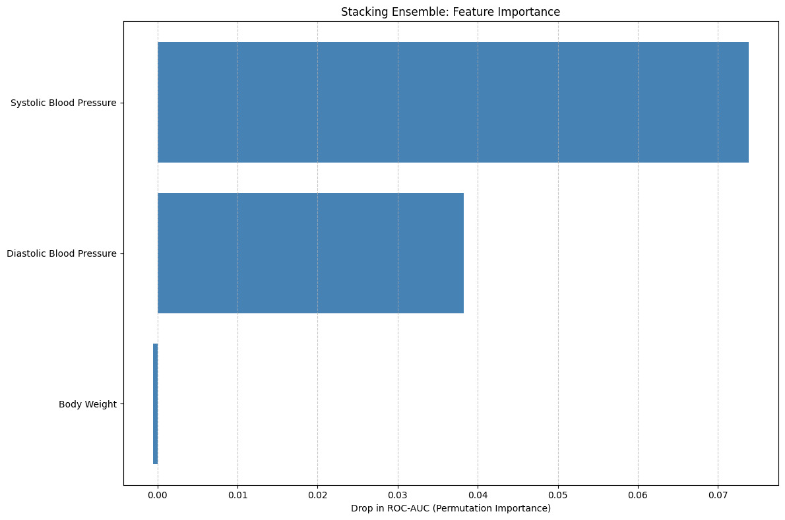

# 🩺 HealthCare Prediction

An intelligent **machine learning** project that predicts **heart failure risk** and provides an **interactive dashboard** for healthcare data visualization and analysis.

---

## 📌 Overview

### ICU Patient Deterioration Prediction

This project predicts patient deterioration in an ICU setting using a stacked ensemble of machine learning models. The workflow includes data preprocessing, feature engineering, dataset balancing, scaling, model training, and evaluation.

### 1) Data Preprocessing and Feature Engineering

Datetime Features: The time column is converted to datetime and decomposed into year, month, day, and hour to capture temporal patterns.

Derived Health Features:

Pulse Pressure (PP): Systolic Blood Pressure - Diastolic Blood Pressure

Mean Arterial Pressure (MAP): Diastolic Blood Pressure + (Pulse Pressure / 3)
These features provide additional insights into cardiovascular health.

Column Cleanup: Irrelevant or sensitive columns like time, CURRENT_TIME, and PATIENT are dropped.

Missing Values: Any missing values are filled using the median of the respective columns.

### 2) Feature Scaling

Features are standardized using StandardScaler to ensure that all features have zero mean and unit variance, which improves model convergence and performance.

### 3) Handling Class Imbalance

ICU datasets often have imbalanced classes (fewer deteriorating events).

SMOTE (Synthetic Minority Oversampling Technique) is used to generate synthetic samples for the minority class, balancing the dataset.

### 4) Train-Test Split

The balanced dataset is split into training (80%) and testing (20%) sets, stratifying by the target label to maintain class proportions.

The predictions from these base models are fed into a final Random Forest estimator in the stacking ensemble, allowing the model to learn from the strengths of each base learner.

passthrough=True ensures the original features are also available to the final estimator for improved prediction.

## 🧠 Model Details

- **Input:** Patient health time-series data
- **Output:** Heart failure risk prediction
- **Tech Stack:** Python, Pandas, Scikit-learn, XGBoost, Streamlit
- **Models Used:**
  - Random Forest
  - XGBoost
  - LightGBM (LGBM)
  - Stacking Classifier (Final Model)

---

#### Model Evaluation

The model is evaluated on the test set using:

Confusion Matrix: Shows true positives, false positives, etc.

Classification Report: Provides precision, recall, F1-score

ROC-AUC Score: Measures the ability of the model to distinguish between classes

---

## Evaluation
| Metric        | Class 0 | Class 1 | Accuracy / Macro Avg / Weighted Avg |
| ------------- | ------- | ------- | ----------------------------------- |
| **Precision** | 0.82    | 0.84    | 0.83                                |
| **Recall**    | 0.85    | 0.82    | 0.83                                |
| **F1-Score**  | 0.83    | 0.83    | 0.83                                |
| **Support**   | 417     | 417     | 834                                 |
| **ROC-AUC**   | -       | -       | 0.931                               |


## 📂 Project Structure

```
HealthCarePrediction/
├── dashboard.py                # Streamlit dashboard app
├── heart_failure_timeseries1.csv  # Dataset
├── scaler.pkl                  # StandardScaler for preprocessing
├── stacking_model.pkl          # Trained ensemble model
└── image.png                   
```

---

## 🚀 Getting Started

### 1️⃣ Clone the Repository

```bash
git clone https://github.com/dexterhere04/HealthCarePrediction.git
cd HealthCarePrediction
```

### 2️⃣ Install Dependencies

```bash
pip install -r requirements.txt
```

### 3️⃣ Run the Dashboard

```bash
streamlit run dashboard.py
```

### 4️⃣ Open in Browser

The app will be available at:
**http://localhost:8501**

Drag and Drop the heart_failure_timeseries1.csv for predictions

---

## 🖼️ Project Demo




